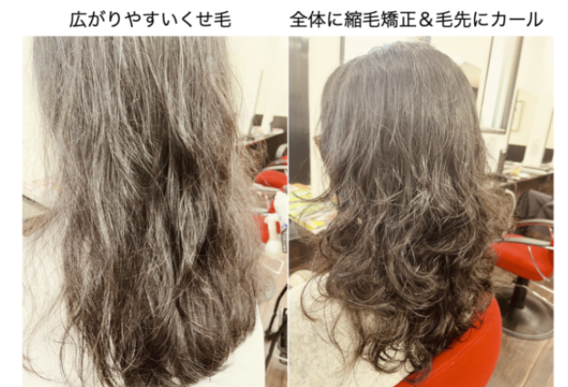

# 隆の縮毛矯正は何が特別なのか

### Ⅰ　水  
### Ⅱ　薬液  
### Ⅲ　技術  
### Ⅳ　スタッフ

---

## Ⅰ 水

**素髪を求めて**

縮毛矯正系の施術は化学変化がメインです。  
そのためには髪の内部にシリコン・ミネラル等が存在すると、酸化還元反応が阻害されます。

家庭内でのシャンプー等で髪内部にミネラル等が蓄積された状態。  
そこで、**marbbの導入。**

Marbbでシャンプーすることによって髪の内部をお掃除。

- **炭酸泉発生機**  
  酸化反応には緩やかな酸化ベスト、炭酸泉は究極の酸性水です。

---

## Ⅰ 軟水機

サロン専用軟水装置。  
水道水に含まれる硬度成分を取り除き、肌にも毛髪にもやさしい軟水をつくります。

---

## Ⅱ 炭酸装置

炭酸泉発生機。  
湯量を変えてもメニューに適した濃度を  
自動コントロールする機能を搭載しました。

酸性水を生成。  
究極の化粧水を髪のために。

---

## Ⅲ marbb

炭酸の2000分の1サイズ、高い泡圧力をもつ marbb のナノバブルは、  
その気泡の細かさ・特殊な振動エネルギーにより、

- 高い洗浄力  
- 薬剤の浸透促進  
- アクアバランスの改善  

を生み出します。

驚きのツヤ感、うねりの修復まで、すべてのサロンワークで活躍。  
**水と空気だけを利用し、薬剤に頼りすぎない**  
究極の髪質改善を提供いたします。

---

## Ⅱ 薬液

メーカーとの協業により薬品開発に着手。  
今までの縮毛矯正の再開発を目指して、半年の研究により、完成。

**ヒントは：**  
- キトサン  
- ハイブリッドひまわり油  
- ペリセア（ジェミニ型両親媒性化合物）

様々な薬品を掛け合わせ、  
施術方法も幾通りも試し、仕上げました。

> ※下記の写真は美容師さんへのお披露目

---

## Ⅲ 技術

- キトサン  
- ハイブリッドひまわり油  
- ペリセア（ジェミニ〈双子〉型両親媒性化合物） など  

様々な薬品を掛け合わせ、施術方法も幾通りも試した結果、  
最大の違いは **薬液塗布前に髪を完全にブローすること。**

乾かした髪に薬剤を塗布することは、基本的には**危険が伴います。**  
薬液がダイレクトに反応して髪が壊れる可能性もあります。

隆のスタッフだからできる技術です。  
- スタッフによる髪質の判断  
- 薬液調合の判断  
- 塗布時間

上記の3要素が完璧でないと**隆の技術は完成されません。**

---

## Ⅳ スタッフ

- スタッフによる髪質の判断  
- 薬液調合の判断  
- 塗布時間

上記の3要素が完璧でないと、隆の技術は完成されません。

---

隆のスタッフは**在籍20年以上**が多数。  
はじめから隆の技術を習得した**ベテランばかり**です。

新人スタッフも**理論から理解している**ので、  
若いスタッフでも安心です。

---

隆のスタッフだからできる縮毛矯正です。  
そして、**縮デジ**──  
お客様からのご要望：

> 縮毛矯正で満足していたお客様。  
> 数年後、  
> お客様曰く、  
> 「この髪に大きいカールが欲しい！」  
> 「隆ならできるはず！」  

スタッフと共に研究し、数年でなんとか完成！

縮毛矯正＋デジタルカール「縮デジ」
またの名を **ストカール**

